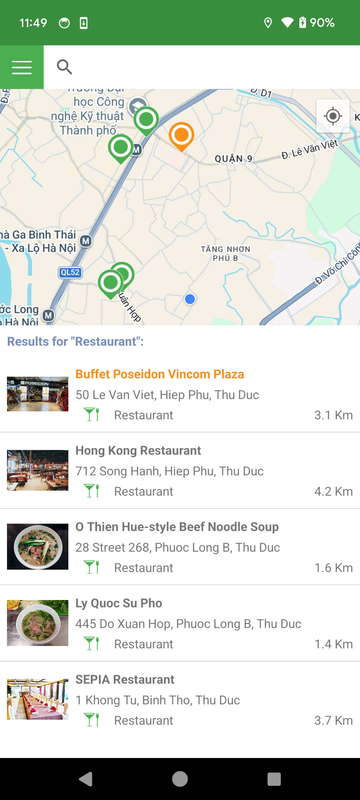
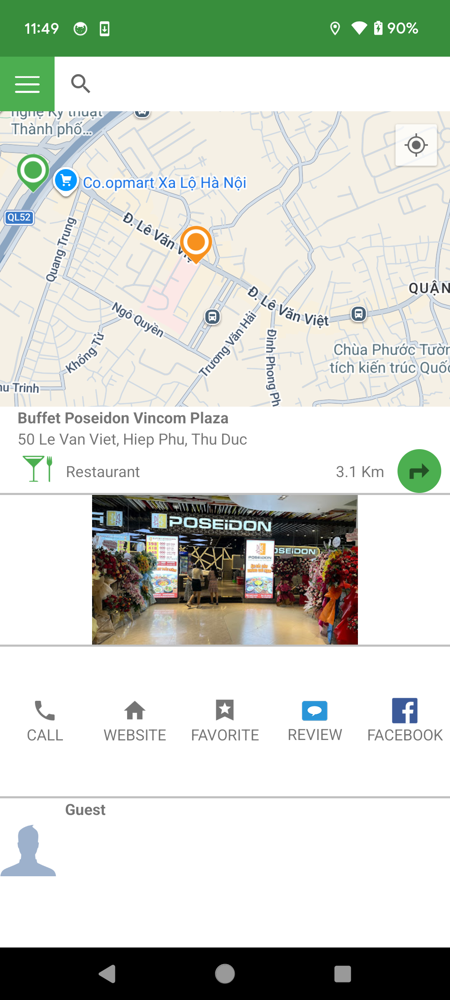
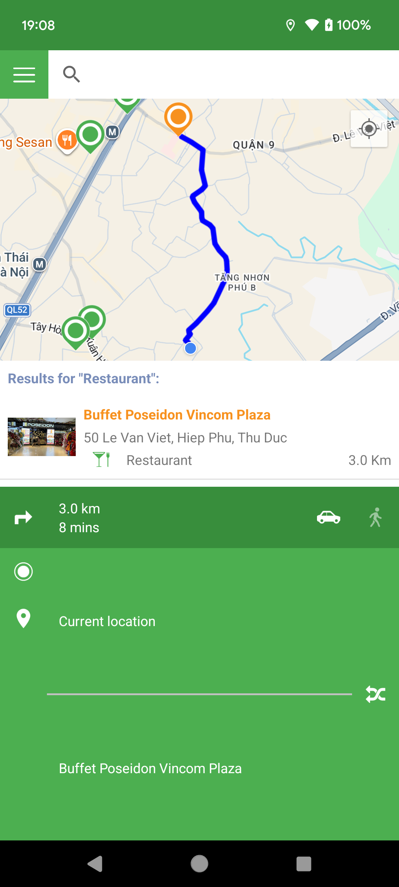

# 🗺️ FindPlacesNearby

**FindPlacesNearby** is an Android application built during my **Android internship in 2016**.

The app uses **Google Maps** to help users discover nearby places, display place details, get directions, and manage favorite locations through an interactive map interface.

⚠️ **Note:** Some APIs used in this project may no longer be available.  
This repository is kept as a reference to my **early Android development work**.

---

# Screenshots

| Search Results | Place Detail | Directions |
|-------------|-------------|-------------|
|  |  |  |

---

# Key Features

## 🔍 Search & Suggestions
- Search places by **name** or **category**
- Show **auto suggestions** while typing
- Display search results **on the map and inside a sliding drawer**
- Save and display **search history**

## 📍 Map & Location
- Integrated **Google Maps Fragment**
- Move camera to **current user location**
- Display **markers** for search results
- Update user position using `OnLocationChanged()`
- **Save and restore map state** between sessions

## 🧭 Directions & Distance
- Get **driving or walking directions** between two points
- Calculate **distance and estimated travel time**
- Allow users to **swap origin and destination**

## ⭐ Place Management
- View **detailed place information**
- Add **reviews** for places
- **Add or remove favorites**
- **Call a place** or open its **website**
- Add **new places to the server**

## 🧩 Interface & Navigation
- **Navigation Drawer** with:
  - 📜 History – View past searches
  - ⭐ Bookmarks – Favorite places
  - ⚙️ Settings – Adjust search radius
- **Sliding Drawer UI** for place details
- Custom **Fragment manager** to control `SearchFragment` and `MapsFragment`
- Proper handling of **Back navigation and UI drawers**

---

# Tech Stack

- Java
- Android SDK
- Google Maps Android API
- Location Services
- Fragments & Navigation Drawer
- AsyncTask for background tasks
- HttpURLConnection for network requests
- SQLite database for storing search history and favorites

---

# Author

Luong Ho  
Android Developer